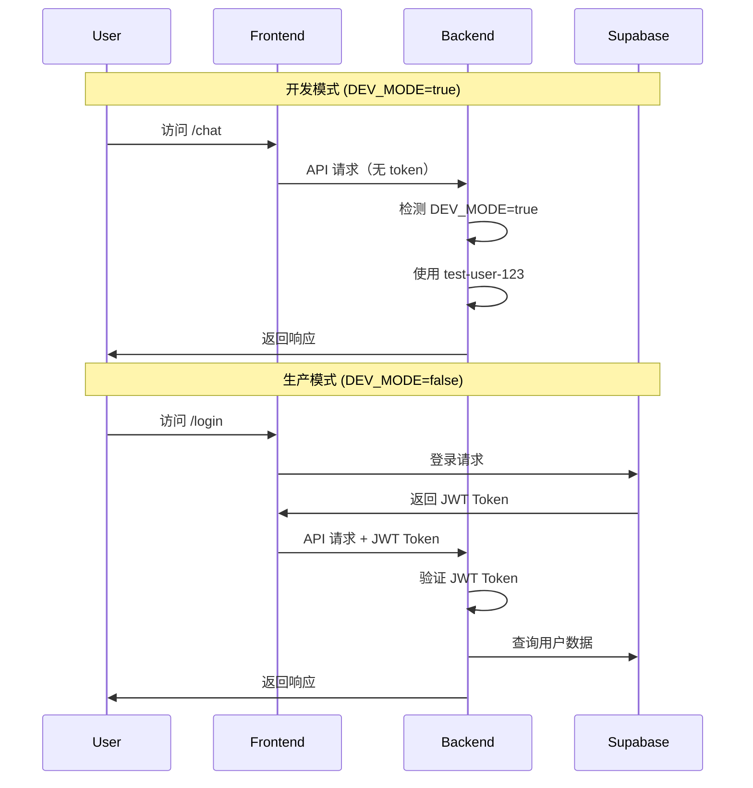

# 📋 开发任务清单 (TODO List)

> **更新日期**: 2026-02-10  
> **项目状态**: 本地开发环境可运行，核心功能已实现，文档已完善，准备生产部署

---

## 🎯 当前项目状态

### ✅ 已完成功能
- [x] **前端 Next.js 架构** - App Router + TypeScript + Tailwind CSS
- [x] **后端 FastAPI 架构** - 分层设计（API/Services/Models/Database）
- [x] **AI 对话功能** - 集成阿里云百炼 API
- [x] **宿舍推荐功能** - 基于用户画像生成个性化推荐
- [x] **用户偏好设置** - 身份、预算、偏好存储
- [x] **开发模式** - 无需登录即可本地测试
- [x] **聊天界面** - 完整的 UI/UX 实现
- [x] **宿舍数据展示** - 设施详情、地理位置等
- [x] **完整的 README.md** - 详细的 Developer Onboarding Guide (2026-02-10)
- [x] **Git 安全性** - 移除爬虫脚本及敏感信息 (2026-02-10)
- [x] **项目结构文档** - 完整的文件树和架构说明
- [x] **依赖版本验证** - 前后端依赖已测试并正常运行
- [x] **依赖安装文档** - README 中添加 npm install 工作原理说明 (2026-02-10)

### 🚧 进行中
- [ ] **依赖版本更新** - 前端依赖有次要更新（Next.js 14.2.35, Supabase 2.95.3 等）
- [ ] **代码清理** - 移除 hardcode，配置化所有环境变量

---

## 🔴 高优先级任务

### 0. 依赖版本管理（可选）

#### 0.1 前端依赖更新
**当前状态**：前端多个依赖有次要版本更新（向后兼容）

**已更新的包**：
- `next`: 14.1.0 → 14.2.35 (次要更新)
- `react`: 18.2.0 → 18.3.1 (次要更新)
- `typescript`: 5.8.2 → 5.8.3 (补丁更新)
- `tailwindcss`: 3.4.1 → 3.4.19 (补丁更新)
- `@supabase/supabase-js`: 2.39.0 → 2.95.3 (次要更新，建议更新文档)
- `axios`: 1.6.5 → 1.13.5 (次要更新，注意breaking changes)

**任务**：
- [ ] 决定是否更新 `package.json` 中的版本范围
- [ ] 测试新版本的兼容性（特别是 Supabase SDK 和 Axios）
- [ ] 更新 README.md 中的版本说明（可选）
- [ ] 如保持当前版本，在文档中注明"测试通过的版本"

**建议**：
- 当前版本运行正常，可以暂不更新
- 如需更新，优先测试 Supabase SDK 2.95.3 的 API 变化

---

### 1. 生产环境配置（必需）

#### 1.1 移除 Hardcode
**当前问题**：
```python
# backend/app/middleware/auth.py (第 42 行)
return TokenData(user_id="test-user-123", email="test@example.com")
```

**任务**：
- [ ] 移除所有 `test-user-123` 硬编码
- [ ] 确保 `DEV_MODE=false` 时强制要求 JWT 认证
- [ ] 添加环境变量验证（启动时检查必需配置）

#### 1.2 JWT Secret 配置
**当前状态**：
```python
# backend/app/middleware/auth.py (第 16 行)
JWT_SECRET = os.getenv("JWT_SECRET", "your-secret-key-change-in-production")
```

**任务**：
- [ ] 生成强随机 JWT_SECRET（生产环境必需）
- [ ] 在 `.env.example` 添加生成说明
- [ ] 文档说明如何生成：`python -c "import secrets; print(secrets.token_urlsafe(32))"`

#### 1.3 Supabase 完整配置
**当前状态**：开发模式跳过了 Supabase

**任务**：
- [ ] 配置 Supabase 项目（数据库 + Auth）
- [ ] 创建数据库表（`profiles`, `chat_logs`）
- [ ] 配置 Row Level Security (RLS) 策略
- [ ] 测试用户注册/登录流程
- [ ] 测试前后端 JWT 令牌传递

**SQL 脚本**（见 `docs/DATABASE.md`）：
```sql
-- 需要在 Supabase 中执行
CREATE TABLE profiles (...);
CREATE TABLE chat_logs (...);
-- 添加 RLS 策略
```

---

### 2. 存储和数据持久化

#### 2.1 聊天记录存储
**当前状态**：聊天记录存储在 Supabase `chat_logs` 表，但未完全测试

**任务**：
- [ ] 验证聊天记录正确存储到数据库
- [ ] 实现聊天历史加载（前端展示历史消息）
- [ ] 添加分页加载（避免一次性加载过多消息）
- [ ] 实现会话管理（多个独立会话）

#### 2.2 推荐结果持久化
**当前状态**：推荐结果仅返回给前端，未存储

**任务**：
- [ ] 创建 `recommendations` 表存储推荐历史
- [ ] 用户可查看历史推荐
- [ ] 用户可收藏/标记推荐结果

**建议表结构**：
```sql
CREATE TABLE recommendations (
  id BIGSERIAL PRIMARY KEY,
  user_id UUID REFERENCES profiles(id),
  advisor_comment TEXT,
  recommendations JSONB,
  created_at TIMESTAMPTZ DEFAULT NOW()
);
```

---

### 3. RAG 知识库集成

#### 3.1 当前状态
**代码位置**：
- `backend/app/services/rag_service.py` - 文件存在但未使用
- `backend/app/api/chat.py` (第 87 行) - 有 `TODO: Implement RAG source tracking` 注释

**任务**：
- [ ] 准备知识库文档（宿舍手册、FAQ 等）
- [ ] 选择向量数据库（Supabase pgvector / Pinecone）
- [ ] 实现文档切片和向量化
- [ ] 集成 RAG 到聊天流程
- [ ] 在回复中显示引用来源（Source Attribution）

**参考架构**：
```
User Query → RAG Retrieval (相关文档) → LLM (百炼) → Response with Sources
```

---

## 🟡 中优先级任务

### 4. 前端功能增强

#### 4.1 用户体验改进
- [ ] 添加加载动画（聊天发送时、推荐生成时）
- [ ] 添加错误提示（网络错误、API 失败）
- [ ] 添加 Toast 通知（操作成功/失败提示）
- [ ] 优化移动端响应式布局

#### 4.2 聊天功能增强
- [ ] 支持多会话管理（创建新会话、删除会话）
- [ ] 支持消息编辑/重发
- [ ] 支持导出聊天记录（PDF/Text）
- [ ] 添加快捷问题按钮（"推荐宿舍"、"查看设施"等）

#### 4.3 推荐功能增强
- [ ] 添加推荐筛选器（按价格、设施、位置）
- [ ] 添加宿舍对比功能（对比 2-3 个宿舍）
- [ ] 添加地图视图（显示宿舍位置）
- [ ] 添加用户评价/评分系统

---

### 5. 后端优化

#### 5.1 性能优化
- [ ] 添加 Redis 缓存（用户 Profile、常见问题回复）
- [ ] 优化百炼 API 调用（流式响应 Streaming）
- [ ] 添加请求日志和监控
- [ ] 添加 API 速率限制（Rate Limiting）

#### 5.2 错误处理
- [ ] 统一错误响应格式
- [ ] 添加详细的错误日志（Sentry 集成）
- [ ] 添加健康检查详细信息（数据库连接、AI 服务状态）

#### 5.3 API 改进
- [ ] 添加 API 版本控制（`/api/v1/...`）
- [ ] 添加请求验证中间件
- [ ] 完善 API 文档（OpenAPI 规范）
- [ ] 添加单元测试和集成测试

---

## 🟢 低优先级任务

### 6. 部署准备

#### 6.1 前端部署（Vercel）
**任务**：
- [ ] 配置 Vercel 项目
- [ ] 设置生产环境变量
- [ ] 配置自定义域名
- [ ] 配置 CDN 和缓存策略
- [ ] 设置环境分支（dev/staging/production）

#### 6.2 后端部署（Render/Railway）
**任务**：
- [ ] 选择部署平台（Render 推荐）
- [ ] 配置 Dockerfile（可选，提升启动速度）
- [ ] 设置生产环境变量
- [ ] 配置健康检查和自动重启
- [ ] 设置日志收集和监控

**参考部署命令**（Render）：
```bash
# Build Command
pip install -r requirements.txt

# Start Command
uvicorn app.main:app --host 0.0.0.0 --port $PORT
```

#### 6.3 数据库备份
- [ ] 配置 Supabase 自动备份
- [ ] 设置数据库迁移脚本（Alembic）
- [ ] 准备数据恢复流程

---

### 7. 代码质量

#### 7.1 测试覆盖
- [ ] 添加后端单元测试（pytest）
- [ ] 添加前端组件测试（Jest + React Testing Library）
- [ ] 添加 E2E 测试（Playwright）
- [ ] 设置 CI/CD 自动测试

#### 7.2 代码规范
- [ ] 配置 ESLint + Prettier（前端）
- [ ] 配置 Black + Flake8（后端）
- [ ] 添加 pre-commit hooks
- [ ] 代码审查流程文档

---

## 📊 开发模式说明

### 当前配置

#### 后端（`backend/.env`）
```env
DEV_MODE=true  # 开发模式开关
BAILIAN_API_KEY=your_key
BAILIAN_APP_ID=your_app_id
# Supabase 配置可选（DEV_MODE=true 时不需要）
```

#### 前端（`frontend/.env.local`）
```env
NEXT_PUBLIC_DEV_MODE=true  # 前端开发模式
NEXT_PUBLIC_API_URL=http://localhost:8000
# Supabase 配置可选（DEV_MODE=true 时不需要）
```

### 开发模式特性

**当 `DEV_MODE=true` 时**：
- ✅ 跳过 JWT 认证（使用测试用户 `test-user-123`）
- ✅ 跳过 Supabase Auth（前端无需登录）
- ✅ 可直接访问 `/chat` 页面
- ✅ 适合快速测试 AI 对话功能

**当 `DEV_MODE=false` 时（生产环境）**：
- ❌ 必须配置 Supabase
- ❌ 必须配置 JWT_SECRET
- ❌ 用户必须登录才能使用
- ✅ 完整的认证和授权流程

---

## 🔐 JWT 和 Supabase 架构说明

### 当前认证流程



### JWT Token 格式
```json
{
  "sub": "user-uuid-from-supabase",
  "email": "user@example.com",
  "iat": 1234567890,
  "exp": 1234567890
}
```

### 存储配置

#### Supabase 表结构
```sql
-- 用户画像表
profiles (
  id UUID PRIMARY KEY,           -- 对应 Supabase Auth 用户 ID
  identity TEXT,                 -- "Undergraduate" | "Postgraduate" | ...
  budget_range TEXT,             -- "Below 10000" | "10000-15000" | ...
  preferences JSONB,             -- {"facilities": [...], "priorities": [...]}
  updated_at TIMESTAMPTZ
)

-- 聊天记录表
chat_logs (
  id BIGSERIAL PRIMARY KEY,
  user_id UUID REFERENCES profiles(id),
  role TEXT CHECK (role IN ('user', 'assistant')),
  content TEXT,
  created_at TIMESTAMPTZ
)
```

#### 未来扩展表（待实现）
```sql
-- 推荐历史表
recommendations (
  id BIGSERIAL PRIMARY KEY,
  user_id UUID REFERENCES profiles(id),
  advisor_comment TEXT,
  recommendations JSONB,
  created_at TIMESTAMPTZ
)

-- 会话管理表
sessions (
  id UUID PRIMARY KEY,
  user_id UUID REFERENCES profiles(id),
  title TEXT,
  created_at TIMESTAMPTZ,
  updated_at TIMESTAMPTZ
)
```

---

## 📦 未来需要做什么

### 短期（1-2 周）
1. **移除所有 hardcode**
   - `test-user-123` → 真实用户 ID
   - `localhost` URL → 环境变量
   - 默认 JWT_SECRET → 强制配置

2. **配置生产环境**
   - Supabase 项目创建
   - 数据库表创建
   - RLS 策略配置

3. **完成文档**
   - 更新 API.md
   - 更新 DEPLOYMENT.md
   - 创建 CONTRIBUTING.md

### 中期（1 个月）
1. **实现 RAG 知识库**
2. **优化用户体验**（加载动画、错误提示）
3. **添加多会话管理**
4. **部署到 Vercel + Render**

### 长期（2-3 个月）
1. **添加测试覆盖**（单元测试 + E2E）
2. **实现推荐结果持久化**
3. **添加用户评价系统**
4. **性能优化**（Redis 缓存、流式响应）

---

## 🤝 协作开发建议

### Git 工作流
```bash
# 创建功能分支
git checkout -b feature/rag-integration

# 开发完成后
git add .
git commit -m "feat: implement RAG knowledge base integration"

# 推送并创建 PR
git push origin feature/rag-integration
```

### 提交规范
- `feat:` 新功能
- `fix:` Bug 修复
- `docs:` 文档更新
- `style:` 代码格式调整
- `refactor:` 代码重构
- `test:` 测试相关
- `chore:` 构建/工具配置

### 代码审查清单
- [ ] 代码符合项目规范
- [ ] 添加必要的注释
- [ ] 更新相关文档
- [ ] 测试通过
- [ ] 无 hardcode
- [ ] 环境变量已配置

---

## 📞 需要帮助？

遇到问题可以：
1. 查看 `docs/` 目录下的文档
2. 查看 GitHub Issues
3. 联系项目负责人

---

**最后更新**: 2026-02-10  
**维护者**: [Project Team]  
**最近变更**:
- 2026-02-10: 添加依赖版本管理说明，更新已完成任务列表
- 2026-02-09: 初始版本，定义开发路线图
